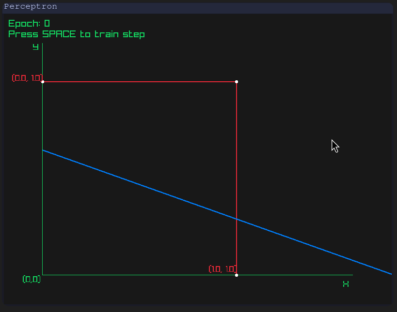

# nn
Neural Network Implementation in C

## Description
There's two implementations:

1. **Perceptron**: Implementation of a simple perceptron in C. The perceptron consists of a single neuron that learns a boolean function.

2. **Neural Network**: Implementation of a simple neural network in C. The neural network consists of sigmoid neurons.
The network is trained using the MNIST dataset, which contains 60,000 training images and 10,000 testing images of handwritten digits. The network is trained to classify the digits from 0 to 9.

## NN Results
The network was trained using the MNIST dataset. The network was trained using 60,000 images and tested using 10,000 images. The network achieved an accuracy of 95.8% on the test set.

**Confusion Matrix**
|     |   0 |   1 |   2 |   3 |   4 |   5 |   6 |   7 |   8 |   9 |
|-----|----:|----:|----:|----:|----:|----:|----:|----:|----:|----:|
| **0** |  966 |    0 |    4 |    1 |    0 |    1 |    0 |    4 |    4 |    0 |
| **1** |    0 | 1122 |    4 |    3 |    0 |    0 |    1 |    1 |    4 |    0 |
| **2** |    4 |    0 | 1005 |    8 |    1 |    0 |    0 |    9 |    4 |    1 |
| **3** |    0 |    0 |    9 |  987 |    0 |    3 |    0 |    3 |    6 |    2 |
| **4** |    3 |    0 |    5 |    2 |  910 |    1 |    1 |    2 |    4 |   54 |
| **5** |    5 |    1 |    4 |   40 |    0 |  807 |    2 |    2 |   25 |    6 |
| **6** |    8 |    3 |   21 |    1 |   10 |    9 |  894 |    0 |   12 |    0 |
| **7** |    1 |    7 |   20 |   18 |    2 |    0 |    0 |  966 |    2 |   12 |
| **8** |    1 |    0 |    7 |   10 |    2 |    2 |    1 |    4 |  945 |    2 |
| **9** |    3 |    2 |    0 |   14 |    5 |    5 |    0 |    7 |    7 |  966 |

**Clasification Metrics**
| Class | Accuracy | Precision | Recall | F1-score |
|-------|----------|-----------|--------|----------|
| 0     | 0.9612   | 0.9748    | 0.9857 | 0.9802   |
| 1     | 0.9774   | 0.9885    | 0.9885 | 0.9885   |
| 2     | 0.9087   | 0.9314    | 0.9738 | 0.9522   |
| 3     | 0.8916   | 0.9105    | 0.9772 | 0.9427   |
| 4     | 0.9082   | 0.9785    | 0.9267 | 0.9519   |
| 5     | 0.8839   | 0.9746    | 0.9047 | 0.9384   |
| 6     | 0.9283   | 0.9944    | 0.9332 | 0.9628   |
| 7     | 0.9113   | 0.9679    | 0.9397 | 0.9536   |
| 8     | 0.9069   | 0.9329    | 0.9702 | 0.9512   |
| 9     | 0.8895   | 0.9262    | 0.9574 | 0.9415   |


## Usage
Compile:
```bash
make -B
```

Perceptron:
```bash
./bin/perceptron
```

Neural Network:
```bash
./bin/digits
```

## Demo (Perceptron)
Below is a gif demonstrating the learning process of the perceptron algorithm. In this example, it successfully learns to linearly separate the labeled points, effectively implementing the AND function:

